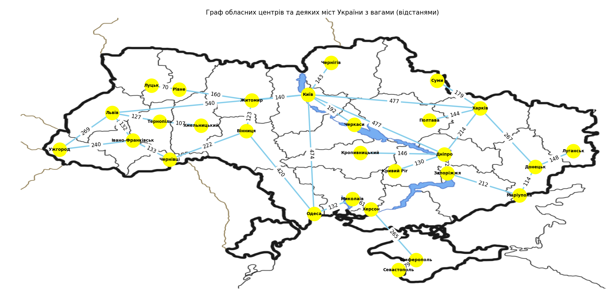

# Завдання 1. Побудова графу та аналіз його основних характеристик

Кількість вершин: 28
Кількість ребер: 32
Ступінь вершин:
Київ: 7
Харків: 5
Одеса: 3
Дніпро: 5
Львів: 4
Запоріжжя: 2
Кривий Ріг: 1
Миколаїв: 2
Маріуполь: 2
Луганськ: 1
Вінниця: 3
Донецьк: 3
Севастополь: 1
Сімферополь: 2
Херсон: 2
Полтава: 1
Чернігів: 1
Черкаси: 1
Житомир: 3
Суми: 1
Хмельницький: 1
Чернівці: 2
Рівне: 2
Кропивницький: 1
Тернопіль: 2
Івано-Франківськ: 3
Луцьк: 1
Ужгород: 2

# Завдання 2. Порівняння алгоритмів BFS та DFS для графа обласних центрів та деяких міст України

## Результати

### BFS (Обхід в ширину)

BFS починається з заданої вершини і обстежує всі сусідні вершини, рухаючись на рівень глибше з кожним кроком. В результаті, вершини, які ближчі до стартової вершини, будуть відвідані раніше. Це дозволяє знайти найкоротші шляхи у неважених графах.

### DFS (Обхід в глибину)

DFS починається з заданої вершини і йде якомога глибше вздовж кожного можливого шляху перед тим, як відступити. Це означає, що вершини, які знаходяться далі від стартової вершини, можуть бути відвідані раніше, ніж сусіди на тому ж рівні. DFS корисний для обстеження всіх вузлів графа або для знаходження шляхів в графах з циклічними структурами.

## Порівняння результатів

Результати BFS і DFS для графа обласних центрів України:

- BFS порядок обходу: Київ -> Харків -> Одеса -> Дніпро -> Львів -> Миколаїв -> Чернігів -> Черкаси -> Житомир -> Полтава -> Суми -> Запоріжжя -> Тернопіль -> Івано-Франківськ -> Маріуполь -> Херсон -> Кривий Ріг -> Рівне -> Донецьк -> Луганськ -> Сімферополь -> Севастополь -> Вінниця -> Чернівці -> Луцьк -> Ужгород -> Хмельницький -> Кропивницький

- DFS порядок обходу: Київ -> Харків -> Дніпро -> Запоріжжя -> Маріуполь -> Донецьк -> Луганськ -> Суми -> Полтава -> Одеса -> Вінниця -> Чернівці -> Івано-Франківськ -> Ужгород -> Львів -> Тернопіль -> Хмельницький -> Черкаси -> Миколаїв -> Херсон -> Сімферополь -> Севастополь -> Житомир -> Рівне -> Луцьк -> Чернігів -> Кривий Ріг -> Кропивницький

## Висновки

- **BFS**: Гарантує, що всі вершини на певному рівні від стартової вершини будуть відвідані до переходу на наступний рівень. Це робить BFS оптимальним для пошуку найкоротшого шляху в неважених графах.
- **DFS**: Глибокий обхід графа дозволяє обстежити всі можливі шляхи до найглибших точок перед поверненням назад. Це робить DFS корисним для повного обстеження графа або знаходження шляхів у графах з циклічними структурами.

Результати відображають природну поведінку цих алгоритмів та підтверджують їх ефективність у відповідних сценаріях застосування.

# Завдання 3. Алгоритм Дейкстри

Результати алгоритму Дейкстри:

- Відстань від Київ до Київ: 0 км
- Відстань від Київ до Харків: 477 км
- Відстань від Київ до Одеса: 474 км
- Відстань від Київ до Дніпро: 477 км
- Відстань від Київ до Львів: 540 км
- Відстань від Київ до Запоріжжя: 549 км
- Відстань від Київ до Кривий Ріг: 607 км
- Відстань від Київ до Миколаїв: 606 км
- Відстань від Київ до Маріуполь: 761 км
- Відстань від Київ до Луганськ: 892 км
- Відстань від Київ до Вінниця: 263 км
- Відстань від Київ до Донецьк: 744 км
- Відстань від Київ до Севастополь: 1011 км
- Відстань від Київ до Сімферополь: 932 км
- Відстань від Київ до Херсон: 667 км
- Відстань від Київ до Полтава: 621 км
- Відстань від Київ до Чернігів: 143 км
- Відстань від Київ до Черкаси: 192 км
- Відстань від Київ до Житомир: 140 км
- Відстань від Київ до Суми: 656 км
- Відстань від Київ до Хмельницький: 774 км
- Відстань від Київ до Чернівці: 485 км
- Відстань від Київ до Рівне: 300 км
- Відстань від Київ до Кропивницький: 623 км
- Відстань від Київ до Тернопіль: 667 км
- Відстань від Київ до Івано-Франківськ: 618 км
- Відстань від Київ до Луцьк: 370 км
- Відстань від Київ до Ужгород: 809 км
